```mermaid
flowchart TB
    subgraph current["_repo.csproj"]
        MAIN["<b>📦&nbsp;_repo.csproj</b><br/><small>net10.0;net8.0</small>"]
        click MAIN "#_repo_repocsproj"
    end

```

```mermaid
flowchart TB
    subgraph upstream["Dependants (2)"]
        P3["<b>📦&nbsp;tom.exe.csproj</b><br/><small>net10.0;net8.0</small>"]
        P4["<b>📦&nbsp;tom.csproj</b><br/><small>net10.0;net8.0</small>"]
        click P3 "#tomexetomexecsproj"
        click P4 "#tomtomcsproj"
    end
    subgraph current["Microcharts.csproj"]
        MAIN["<b>📦&nbsp;Microcharts.csproj</b><br/><small>netstandard2.0</small>"]
        click MAIN "#c:repostompostlertomsubsmicrochartssourcesmicrochartsmicrochartscsproj"
    end
    P3 --> MAIN
    P4 --> MAIN

```

```mermaid
flowchart TB
    subgraph current["tests.csproj"]
        MAIN["<b>📦&nbsp;tests.csproj</b><br/><small>net10.0;net8.0</small>"]
        click MAIN "#teststestscsproj"
    end
    subgraph downstream["Dependencies (1"]
        P5["<b>📦&nbsp;util.csproj</b><br/><small>net10.0;net8.0</small>"]
        click P5 "#utilutilcsproj"
    end
    MAIN --> P5

```

```mermaid
flowchart TB
    subgraph current["tom.exe.csproj"]
        MAIN["<b>📦&nbsp;tom.exe.csproj</b><br/><small>net10.0;net8.0</small>"]
        click MAIN "#tomexetomexecsproj"
    end
    subgraph downstream["Dependencies (3"]
        P5["<b>📦&nbsp;util.csproj</b><br/><small>net10.0;net8.0</small>"]
        P6["<b>📦&nbsp;ws.contracts.csproj</b><br/><small>net10.0;net8.0</small>"]
        P1["<b>📦&nbsp;Microcharts.csproj</b><br/><small>netstandard2.0</small>"]
        click P5 "#utilutilcsproj"
        click P6 "#wscontractswscontractscsproj"
        click P1 "#c:repostompostlertomsubsmicrochartssourcesmicrochartsmicrochartscsproj"
    end
    MAIN --> P5
    MAIN --> P6
    MAIN --> P1

```

```mermaid
flowchart TB
    subgraph upstream["Dependants (4)"]
        P2["<b>📦&nbsp;tests.csproj</b><br/><small>net10.0;net8.0</small>"]
        P3["<b>📦&nbsp;tom.exe.csproj</b><br/><small>net10.0;net8.0</small>"]
        P4["<b>📦&nbsp;tom.csproj</b><br/><small>net10.0;net8.0</small>"]
        P7["<b>📦&nbsp;ws.csproj</b><br/><small>net10.0;net8.0</small>"]
        click P2 "#teststestscsproj"
        click P3 "#tomexetomexecsproj"
        click P4 "#tomtomcsproj"
        click P7 "#wswscsproj"
    end
    subgraph current["util.csproj"]
        MAIN["<b>📦&nbsp;util.csproj</b><br/><small>net10.0;net8.0</small>"]
        click MAIN "#utilutilcsproj"
    end
    P2 --> MAIN
    P3 --> MAIN
    P4 --> MAIN
    P7 --> MAIN

```

```mermaid
flowchart TB
    subgraph upstream["Dependants (2)"]
        P3["<b>📦&nbsp;tom.exe.csproj</b><br/><small>net10.0;net8.0</small>"]
        P7["<b>📦&nbsp;ws.csproj</b><br/><small>net10.0;net8.0</small>"]
        click P3 "#tomexetomexecsproj"
        click P7 "#wswscsproj"
    end
    subgraph current["ws.contracts.csproj"]
        MAIN["<b>📦&nbsp;ws.contracts.csproj</b><br/><small>net10.0;net8.0</small>"]
        click MAIN "#wscontractswscontractscsproj"
    end
    P3 --> MAIN
    P7 --> MAIN

```

```mermaid
flowchart TB
    subgraph upstream["Dependants (1)"]
        P4["<b>📦&nbsp;tom.csproj</b><br/><small>net10.0;net8.0</small>"]
        click P4 "#tomtomcsproj"
    end
    subgraph current["ws.csproj"]
        MAIN["<b>📦&nbsp;ws.csproj</b><br/><small>net10.0;net8.0</small>"]
        click MAIN "#wswscsproj"
    end
    subgraph downstream["Dependencies (2"]
        P5["<b>📦&nbsp;util.csproj</b><br/><small>net10.0;net8.0</small>"]
        P6["<b>📦&nbsp;ws.contracts.csproj</b><br/><small>net10.0;net8.0</small>"]
        click P5 "#utilutilcsproj"
        click P6 "#wscontractswscontractscsproj"
    end
    P4 --> MAIN
    MAIN --> P5
    MAIN --> P6

```

# Projects and dependencies analysis

This document provides a comprehensive overview of the projects and their dependencies in the context of upgrading to .NETCoreApp,Version=v8.0.

## Table of Contents

- [Executive Summary](#executive-Summary)
  - [Highlevel Metrics](#highlevel-metrics)
  - [Projects Compatibility](#projects-compatibility)
  - [Package Compatibility](#package-compatibility)
  - [API Compatibility](#api-compatibility)
- [Aggregate NuGet packages details](#aggregate-nuget-packages-details)
- [Top API Migration Challenges](#top-api-migration-challenges)
  - [Technologies and Features](#technologies-and-features)
  - [Most Frequent API Issues](#most-frequent-api-issues)
- [Projects Relationship Graph](#projects-relationship-graph)
- [Project Details](#project-details)

  - [_repo\_repo.csproj](#_repo_repocsproj)
  - [C:\repos\tompostler\tom\subs\Microcharts\Sources\Microcharts\Microcharts.csproj](#c:repostompostlertomsubsmicrochartssourcesmicrochartsmicrochartscsproj)
  - [tests\tests.csproj](#teststestscsproj)
  - [tom.exe\tom.exe.csproj](#tomexetomexecsproj)
  - [tom\tom.csproj](#tomtomcsproj)
  - [util\util.csproj](#utilutilcsproj)
  - [ws.contracts\ws.contracts.csproj](#wscontractswscontractscsproj)
  - [ws\ws.csproj](#wswscsproj)

## Executive Summary

### Highlevel Metrics

| Metric | Count | Status |
| :--- | :---: | :--- |
| Total Projects | 8 | 1 require upgrade |
| Total NuGet Packages | 8 | 1 need upgrade |
| Total Code Files | 90 |  |
| Total Code Files with Incidents | 1 |  |
| Total Lines of Code | 12264 |  |
| Total Number of Issues | 2 |  |
| Estimated LOC to modify | 0+ | at least 0.0% of codebase |

### Projects Compatibility

| Project | Target Framework | Difficulty | Package Issues | API Issues | Est. LOC Impact | Description |
| :--- | :---: | :---: | :---: | :---: | :---: | :--- |
| [_repo\_repo.csproj](#_repo_repocsproj) | net10.0;net8.0 | ✅ None | 0 | 0 |  | ClassLibrary, Sdk Style = True |
| [C:\repos\tompostler\tom\subs\Microcharts\Sources\Microcharts\Microcharts.csproj](#c:repostompostlertomsubsmicrochartssourcesmicrochartsmicrochartscsproj) | netstandard2.0 | 🟢 Low | 2 | 0 |  | ClassLibrary, Sdk Style = True |
| [tests\tests.csproj](#teststestscsproj) | net10.0;net8.0 | ✅ None | 0 | 0 |  | DotNetCoreApp, Sdk Style = True |
| [tom.exe\tom.exe.csproj](#tomexetomexecsproj) | net10.0;net8.0 | ✅ None | 0 | 0 |  | DotNetCoreApp, Sdk Style = True |
| [tom\tom.csproj](#tomtomcsproj) | net10.0;net8.0 | ✅ None | 0 | 0 |  | DotNetCoreApp, Sdk Style = True |
| [util\util.csproj](#utilutilcsproj) | net10.0;net8.0 | ✅ None | 0 | 0 |  | ClassLibrary, Sdk Style = True |
| [ws.contracts\ws.contracts.csproj](#wscontractswscontractscsproj) | net10.0;net8.0 | ✅ None | 0 | 0 |  | ClassLibrary, Sdk Style = True |
| [ws\ws.csproj](#wswscsproj) | net10.0;net8.0 | ✅ None | 0 | 0 |  | AspNetCore, Sdk Style = True |

### Package Compatibility

| Status | Count | Percentage |
| :--- | :---: | :---: |
| ✅ Compatible | 7 | 87.5% |
| ⚠️ Incompatible | 0 | 0.0% |
| 🔄 Upgrade Recommended | 1 | 12.5% |
| ***Total NuGet Packages*** | ***8*** | ***100%*** |

### API Compatibility

| Category | Count | Impact |
| :--- | :---: | :--- |
| 🔴 Binary Incompatible | 0 | High - Require code changes |
| 🟡 Source Incompatible | 0 | Medium - Needs re-compilation and potential conflicting API error fixing |
| 🔵 Behavioral change | 0 | Low - Behavioral changes that may require testing at runtime |
| ✅ Compatible | 4371 |  |
| ***Total APIs Analyzed*** | ***4371*** |  |

## Aggregate NuGet packages details

| Package | Current Version | Suggested Version | Projects | Description |
| :--- | :---: | :---: | :--- | :--- |
| Microsoft.Extensions.Logging.Abstractions | 10.0.0 |  | [util.csproj](#utilutilcsproj) | ✅Compatible |
| MSTest | 4.0.2 |  | [tests.csproj](#teststestscsproj) | ✅Compatible |
| Nerdbank.GitVersioning | 3.9.* |  | [_repo.csproj](#_repo_repocsproj) [tests.csproj](#teststestscsproj) [tom.csproj](#tomtomcsproj) [tom.exe.csproj](#tomexetomexecsproj) [util.csproj](#utilutilcsproj) [ws.contracts.csproj](#wscontractswscontractscsproj) [ws.csproj](#wswscsproj) | ✅Compatible |
| NETStandard.Library | 2.0.3 |  | [Microcharts.csproj](#c:repostompostlertomsubsmicrochartssourcesmicrochartsmicrochartscsproj) | ✅Compatible |
| SkiaSharp | 2.88.3 | 3.119.1 | [Microcharts.csproj](#c:repostompostlertomsubsmicrochartssourcesmicrochartsmicrochartscsproj) | NuGet package contains security vulnerability |
| System.CommandLine | 2.0.0-beta4.22272.1 |  | [tom.csproj](#tomtomcsproj) [tom.exe.csproj](#tomexetomexecsproj) | ✅Compatible |
| System.Drawing.Common | 10.0.0 |  | [util.csproj](#utilutilcsproj) | ✅Compatible |
| System.ValueTuple | 4.5.0 |  | [Microcharts.csproj](#c:repostompostlertomsubsmicrochartssourcesmicrochartsmicrochartscsproj) | NuGet package functionality is included with framework reference |

## Top API Migration Challenges

### Technologies and Features

| Technology | Issues | Percentage | Migration Path |
| :--- | :---: | :---: | :--- |

### Most Frequent API Issues

| API | Count | Percentage | Category |
| :--- | :---: | :---: | :--- |

## Projects Relationship Graph

Legend:
📦 SDK-style project
⚙️ Classic project

```mermaid
flowchart LR
    P1["<b>📦&nbsp;Microcharts.csproj</b><br/><small>netstandard2.0</small>"]
    P2["<b>📦&nbsp;tests.csproj</b><br/><small>net10.0;net8.0</small>"]
    P3["<b>📦&nbsp;tom.exe.csproj</b><br/><small>net10.0;net8.0</small>"]
    P4["<b>📦&nbsp;tom.csproj</b><br/><small>net10.0;net8.0</small>"]
    P5["<b>📦&nbsp;util.csproj</b><br/><small>net10.0;net8.0</small>"]
    P6["<b>📦&nbsp;ws.contracts.csproj</b><br/><small>net10.0;net8.0</small>"]
    P7["<b>📦&nbsp;ws.csproj</b><br/><small>net10.0;net8.0</small>"]
    P8["<b>📦&nbsp;_repo.csproj</b><br/><small>net10.0;net8.0</small>"]
    P2 --> P5
    P3 --> P5
    P3 --> P6
    P3 --> P1
    P4 --> P5
    P4 --> P7
    P4 --> P1
    P7 --> P5
    P7 --> P6
    click P1 "#c:repostompostlertomsubsmicrochartssourcesmicrochartsmicrochartscsproj"
    click P2 "#teststestscsproj"
    click P3 "#tomexetomexecsproj"
    click P4 "#tomtomcsproj"
    click P5 "#utilutilcsproj"
    click P6 "#wscontractswscontractscsproj"
    click P7 "#wswscsproj"
    click P8 "#_repo_repocsproj"

```

## Project Details

### _repo\_repo.csproj

#### Project Info

- **Current Target Framework:** net10.0;net8.0✅
- **SDK-style**: True
- **Project Kind:** ClassLibrary
- **Dependencies**: 0
- **Dependants**: 0
- **Number of Files**: 0
- **Lines of Code**: 0
- **Estimated LOC to modify**: 0+ (at least 0.0% of the project)

#### Dependency Graph

Legend:
📦 SDK-style project
⚙️ Classic project

### API Compatibility

| Category | Count | Impact |
| :--- | :---: | :--- |
| 🔴 Binary Incompatible | 0 | High - Require code changes |
| 🟡 Source Incompatible | 0 | Medium - Needs re-compilation and potential conflicting API error fixing |
| 🔵 Behavioral change | 0 | Low - Behavioral changes that may require testing at runtime |
| ✅ Compatible | 0 |  |
| ***Total APIs Analyzed*** | ***0*** |  |

### C:\repos\tompostler\tom\subs\Microcharts\Sources\Microcharts\Microcharts.csproj

#### Project Info

- **Current Target Framework:** netstandard2.0✅
- **SDK-style**: True
- **Project Kind:** ClassLibrary
- **Dependencies**: 0
- **Dependants**: 2
- **Number of Files**: 36
- **Number of Files with Incidents**: 1
- **Lines of Code**: 4322
- **Estimated LOC to modify**: 0+ (at least 0.0% of the project)

#### Dependency Graph

Legend:
📦 SDK-style project
⚙️ Classic project

### API Compatibility

| Category | Count | Impact |
| :--- | :---: | :--- |
| 🔴 Binary Incompatible | 0 | High - Require code changes |
| 🟡 Source Incompatible | 0 | Medium - Needs re-compilation and potential conflicting API error fixing |
| 🔵 Behavioral change | 0 | Low - Behavioral changes that may require testing at runtime |
| ✅ Compatible | 4371 |  |
| ***Total APIs Analyzed*** | ***4371*** |  |

#### Project Package References

| Package | Type | Current Version | Suggested Version | Description |
| :--- | :---: | :---: | :---: | :--- |
| NETStandard.Library | 🔗*Transitive* | 2.0.3 |  | ✅Compatible |
| SkiaSharp | Explicit | 2.88.3 | 3.119.1 | NuGet package contains security vulnerability |
| System.ValueTuple | Explicit | 4.5.0 |  | NuGet package functionality is included with framework reference |

### tests\tests.csproj

#### Project Info

- **Current Target Framework:** net10.0;net8.0✅
- **SDK-style**: True
- **Project Kind:** DotNetCoreApp
- **Dependencies**: 1
- **Dependants**: 0
- **Number of Files**: 4
- **Lines of Code**: 95
- **Estimated LOC to modify**: 0+ (at least 0.0% of the project)

#### Dependency Graph

Legend:
📦 SDK-style project
⚙️ Classic project

### API Compatibility

| Category | Count | Impact |
| :--- | :---: | :--- |
| 🔴 Binary Incompatible | 0 | High - Require code changes |
| 🟡 Source Incompatible | 0 | Medium - Needs re-compilation and potential conflicting API error fixing |
| 🔵 Behavioral change | 0 | Low - Behavioral changes that may require testing at runtime |
| ✅ Compatible | 0 |  |
| ***Total APIs Analyzed*** | ***0*** |  |

### tom.exe\tom.exe.csproj

#### Project Info

- **Current Target Framework:** net10.0;net8.0✅
- **SDK-style**: True
- **Project Kind:** DotNetCoreApp
- **Dependencies**: 3
- **Dependants**: 0
- **Number of Files**: 14
- **Lines of Code**: 1933
- **Estimated LOC to modify**: 0+ (at least 0.0% of the project)

#### Dependency Graph

Legend:
📦 SDK-style project
⚙️ Classic project

### API Compatibility

| Category | Count | Impact |
| :--- | :---: | :--- |
| 🔴 Binary Incompatible | 0 | High - Require code changes |
| 🟡 Source Incompatible | 0 | Medium - Needs re-compilation and potential conflicting API error fixing |
| 🔵 Behavioral change | 0 | Low - Behavioral changes that may require testing at runtime |
| ✅ Compatible | 0 |  |
| ***Total APIs Analyzed*** | ***0*** |  |

### tom\tom.csproj

#### Project Info

- **Current Target Framework:** net10.0;net8.0✅
- **SDK-style**: True
- **Project Kind:** DotNetCoreApp
- **Dependencies**: 3
- **Dependants**: 0
- **Number of Files**: 15
- **Lines of Code**: 2032
- **Estimated LOC to modify**: 0+ (at least 0.0% of the project)

#### Dependency Graph

Legend:
📦 SDK-style project
⚙️ Classic project

### API Compatibility

| Category | Count | Impact |
| :--- | :---: | :--- |
| 🔴 Binary Incompatible | 0 | High - Require code changes |
| 🟡 Source Incompatible | 0 | Medium - Needs re-compilation and potential conflicting API error fixing |
| 🔵 Behavioral change | 0 | Low - Behavioral changes that may require testing at runtime |
| ✅ Compatible | 0 |  |
| ***Total APIs Analyzed*** | ***0*** |  |

### util\util.csproj

#### Project Info

- **Current Target Framework:** net10.0;net8.0✅
- **SDK-style**: True
- **Project Kind:** ClassLibrary
- **Dependencies**: 0
- **Dependants**: 4
- **Number of Files**: 16
- **Lines of Code**: 3239
- **Estimated LOC to modify**: 0+ (at least 0.0% of the project)

#### Dependency Graph

Legend:
📦 SDK-style project
⚙️ Classic project

### API Compatibility

| Category | Count | Impact |
| :--- | :---: | :--- |
| 🔴 Binary Incompatible | 0 | High - Require code changes |
| 🟡 Source Incompatible | 0 | Medium - Needs re-compilation and potential conflicting API error fixing |
| 🔵 Behavioral change | 0 | Low - Behavioral changes that may require testing at runtime |
| ✅ Compatible | 0 |  |
| ***Total APIs Analyzed*** | ***0*** |  |

### ws.contracts\ws.contracts.csproj

#### Project Info

- **Current Target Framework:** net10.0;net8.0✅
- **SDK-style**: True
- **Project Kind:** ClassLibrary
- **Dependencies**: 0
- **Dependants**: 2
- **Number of Files**: 2
- **Lines of Code**: 136
- **Estimated LOC to modify**: 0+ (at least 0.0% of the project)

#### Dependency Graph

Legend:
📦 SDK-style project
⚙️ Classic project

### API Compatibility

| Category | Count | Impact |
| :--- | :---: | :--- |
| 🔴 Binary Incompatible | 0 | High - Require code changes |
| 🟡 Source Incompatible | 0 | Medium - Needs re-compilation and potential conflicting API error fixing |
| 🔵 Behavioral change | 0 | Low - Behavioral changes that may require testing at runtime |
| ✅ Compatible | 0 |  |
| ***Total APIs Analyzed*** | ***0*** |  |

### ws\ws.csproj

#### Project Info

- **Current Target Framework:** net10.0;net8.0✅
- **SDK-style**: True
- **Project Kind:** AspNetCore
- **Dependencies**: 2
- **Dependants**: 1
- **Number of Files**: 5
- **Lines of Code**: 507
- **Estimated LOC to modify**: 0+ (at least 0.0% of the project)

#### Dependency Graph

Legend:
📦 SDK-style project
⚙️ Classic project

### API Compatibility

| Category | Count | Impact |
| :--- | :---: | :--- |
| 🔴 Binary Incompatible | 0 | High - Require code changes |
| 🟡 Source Incompatible | 0 | Medium - Needs re-compilation and potential conflicting API error fixing |
| 🔵 Behavioral change | 0 | Low - Behavioral changes that may require testing at runtime |
| ✅ Compatible | 0 |  |
| ***Total APIs Analyzed*** | ***0*** |  |

